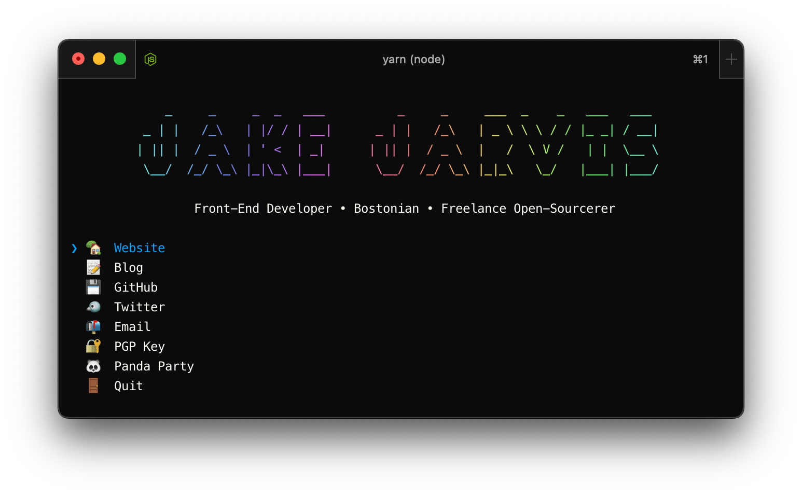

import PageTitle from "../../components/PageTitle";
import { metadata as defaultMetadata } from "../layout";

import featuredImage from "./screenshot.png";

export const metadata = {
  title: "CLI",
  description: "AKA, the most useless Node module ever published, in history, by anyone, ever.",
  openGraph: {
    ...defaultMetadata.openGraph,
    title: "CLI",
    images: [featuredImage.src],
    url: "/cli",
  },
  alternates: {
    ...defaultMetadata.alternates,
    canonical: "/cli",
  },
};

<PageTitle canonical="/cli">CLI</PageTitle>

> The [Jake Jarvis](https://jarv.is/) CLI (aka the most useless Node module ever published, in history, by anyone, ever).



## Usage

```sh
npx @jakejarvis/cli
```

## Inspired by

- [@sindresorhus/sindresorhus-cli](https://github.com/sindresorhus/sindresorhus-cli)
- [@yg/ygcodes](https://github.com/yg/ygcodes)

## Built with

- [ink](https://github.com/vadimdemedes/ink) - React for interactive command-line apps
- [meow](https://github.com/sindresorhus/meow) - CLI helper

[View source on GitHub.](https://github.com/jakejarvis/jakejarvis/tree/main/cli)

## License

MIT © [Jake Jarvis](https://jarv.is/), [Sindre Sorhus](https://sindresorhus.com/)
