import PageTitle from "@/components/layout/page-title";
import Marquee from "@/components/marquee";
import { Win95Icon } from "@/components/icons";
import { createMetadata } from "@/lib/metadata";
import { ComicNeue } from "@/lib/fonts";

export const metadata = createMetadata({
  title: "Previously on...",
  description: "An incredibly embarrassing and somewhat painful trip down this site's memory lane...",
  canonical: "/previously",
});

export const WarningMarquee = () => (
  <Marquee>
    
      🚨 Trigger warning: excessive marquees, animated GIFs, Comic Sans, popups,{" "}
      <code className="text-[0.9rem] font-normal">
        color: limegreen
      </code>{" "}
      ahead...
    
  </Marquee>
);

export const PageStyles = () => (
  
);

<PageStyles />

<PageTitle canonical="/previously" className="font-semibold">
  <>Previously</>
</PageTitle>

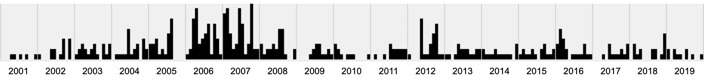
_Previously on the [Cringey Chronicles&trade;](https://web.archive.org/web/20010501000000*/jakejarvis.com) of this website's past..._

---

<WarningMarquee />

[<Win95Icon className="inline size-4 align-text-top" /> Click here for the _full_ experience (at your own risk).](https://y2k.pages.dev)

<iframe
  src="https://jakejarvis.github.io/my-first-website/"
  title="My Terrible, Horrible, No Good, Very Bad First Website"
  className="border-ring h-[500px] w-full border-2"
/>
_[November 2001](https://jakejarvis.github.io/my-first-website/) ([view
source](https://github.com/jakejarvis/my-first-website))_

---

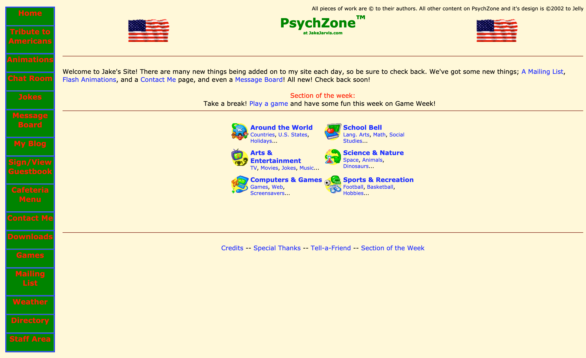
_February 2002_

---

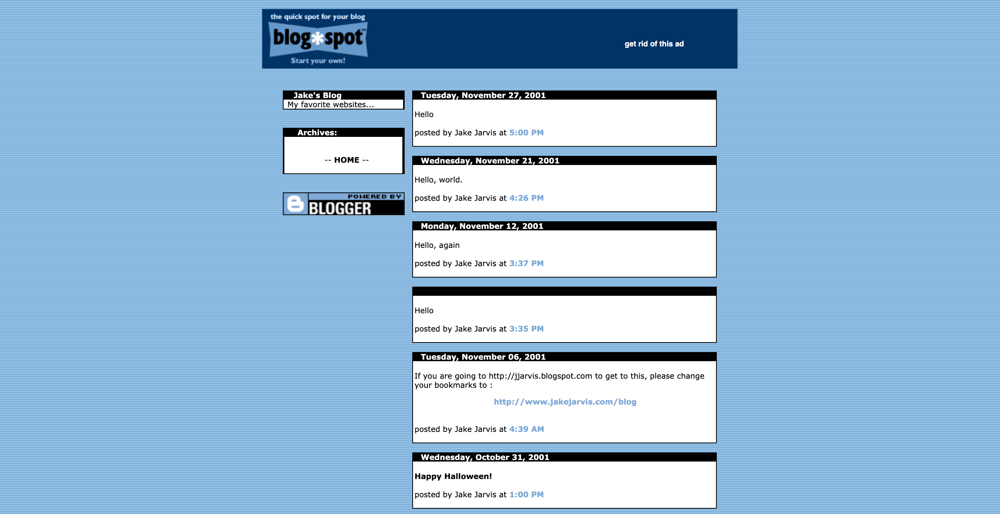
_October 2002_

---

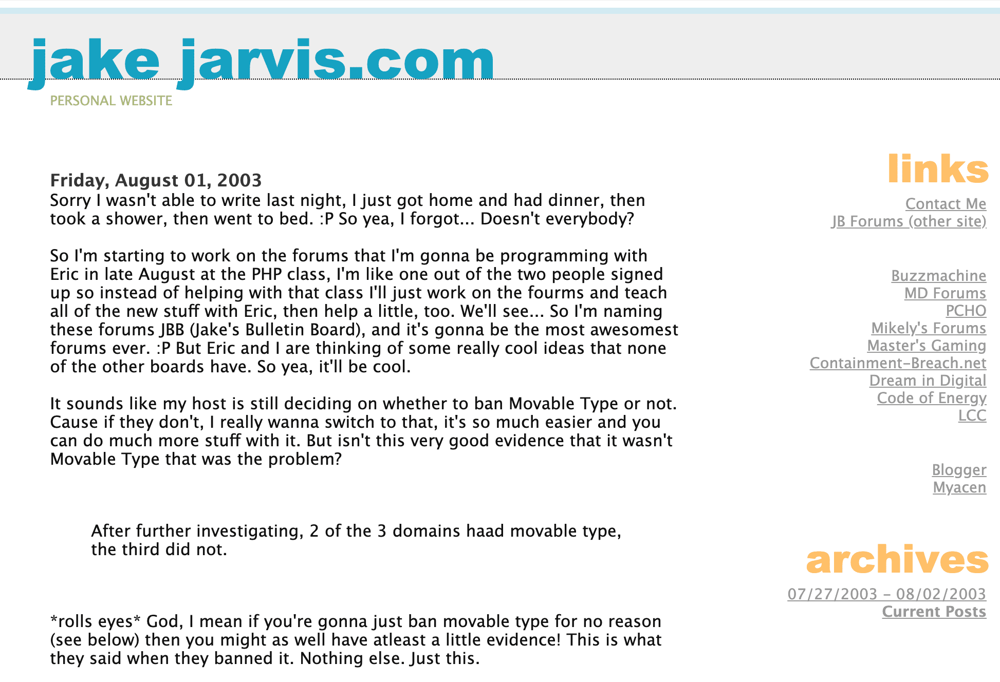
_August 2003_

---

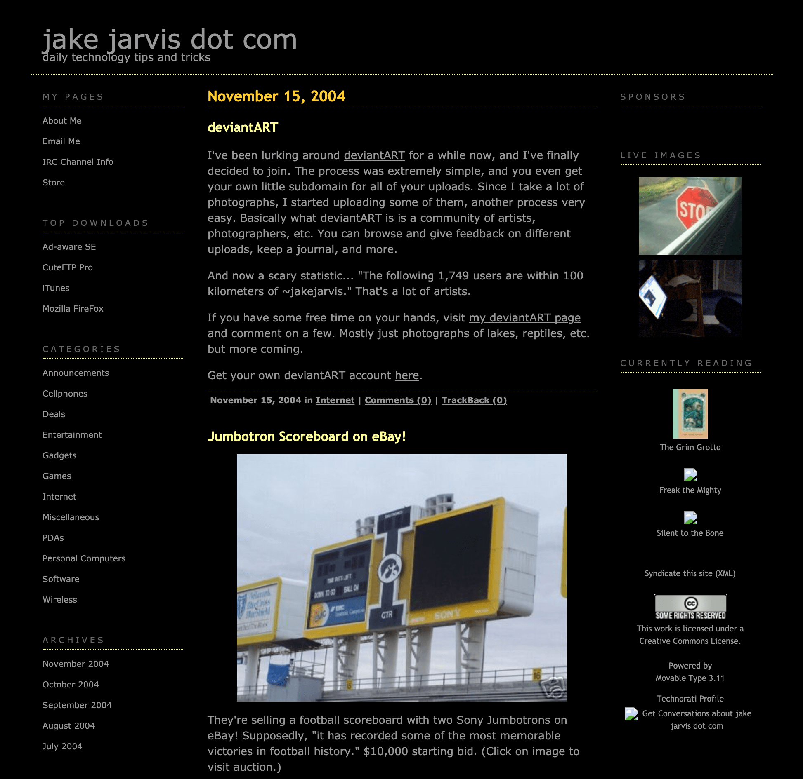
_November 2004_

---

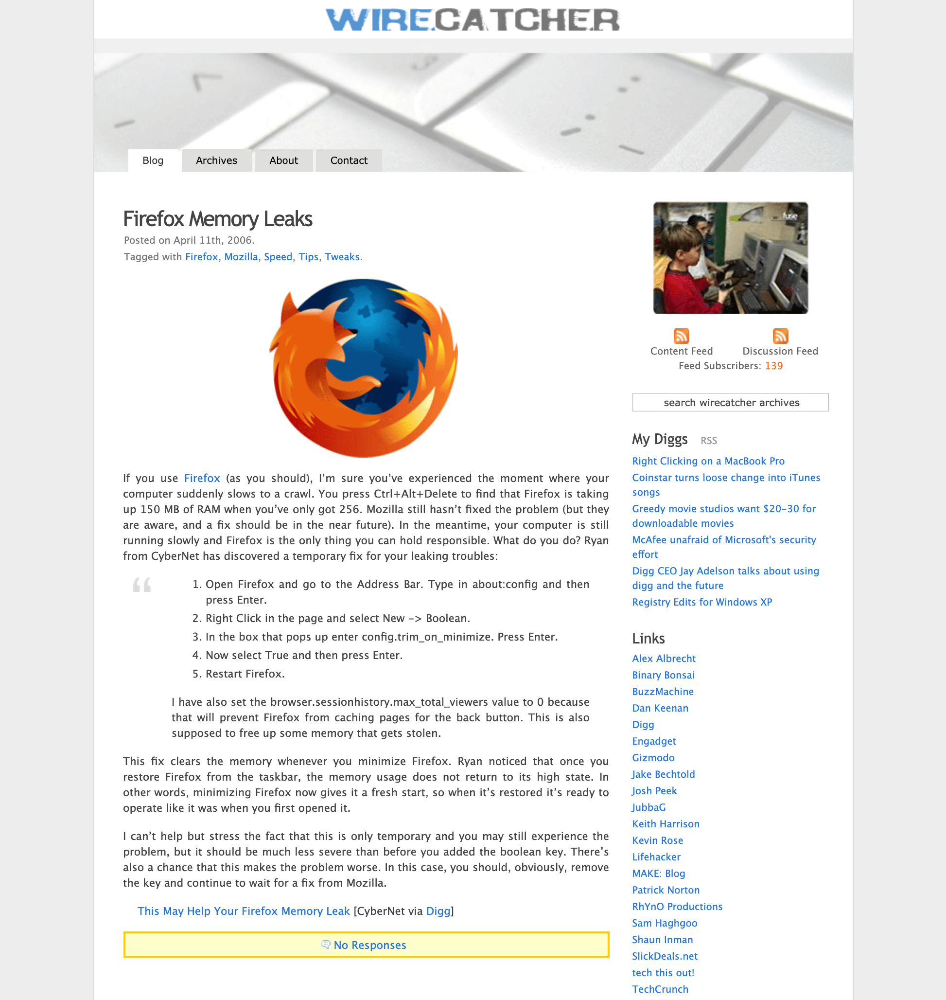
_April 2006_

---

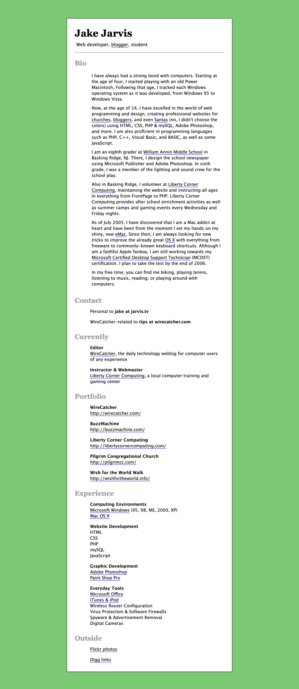
_May 2006_

---

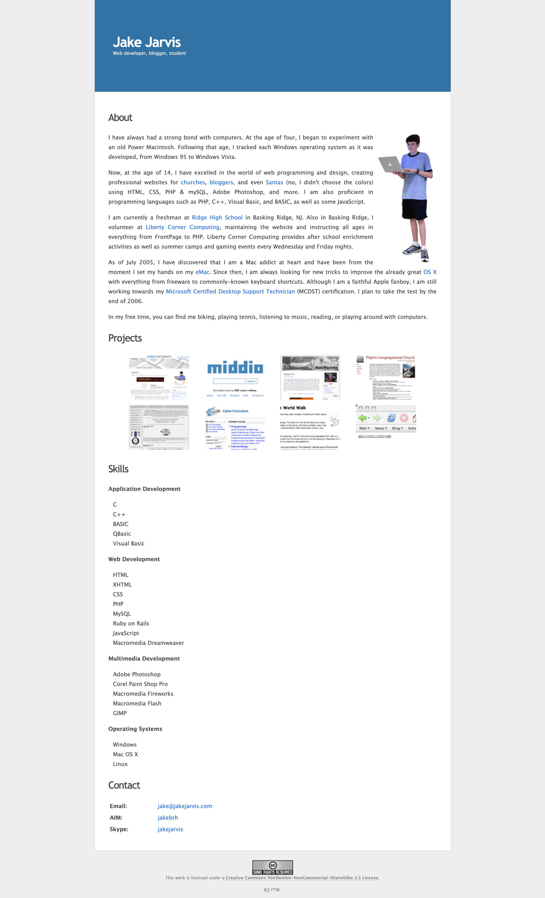
_January 2007_

---

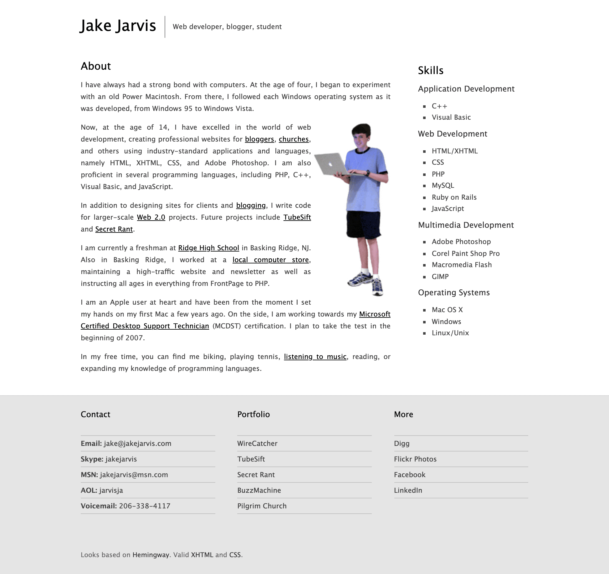
_April 2007_

---

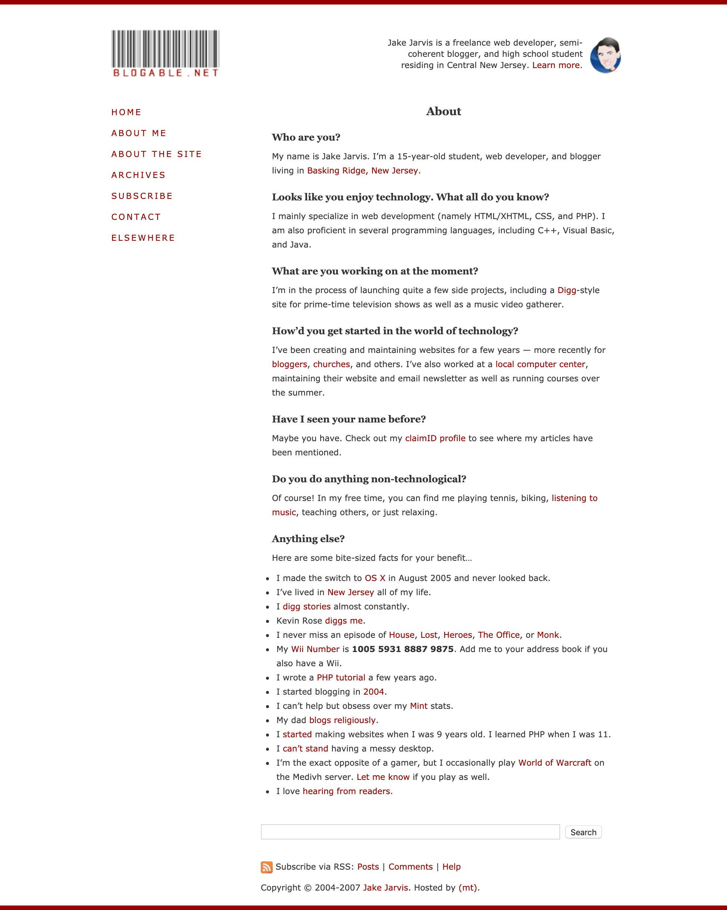
_May 2007_

---

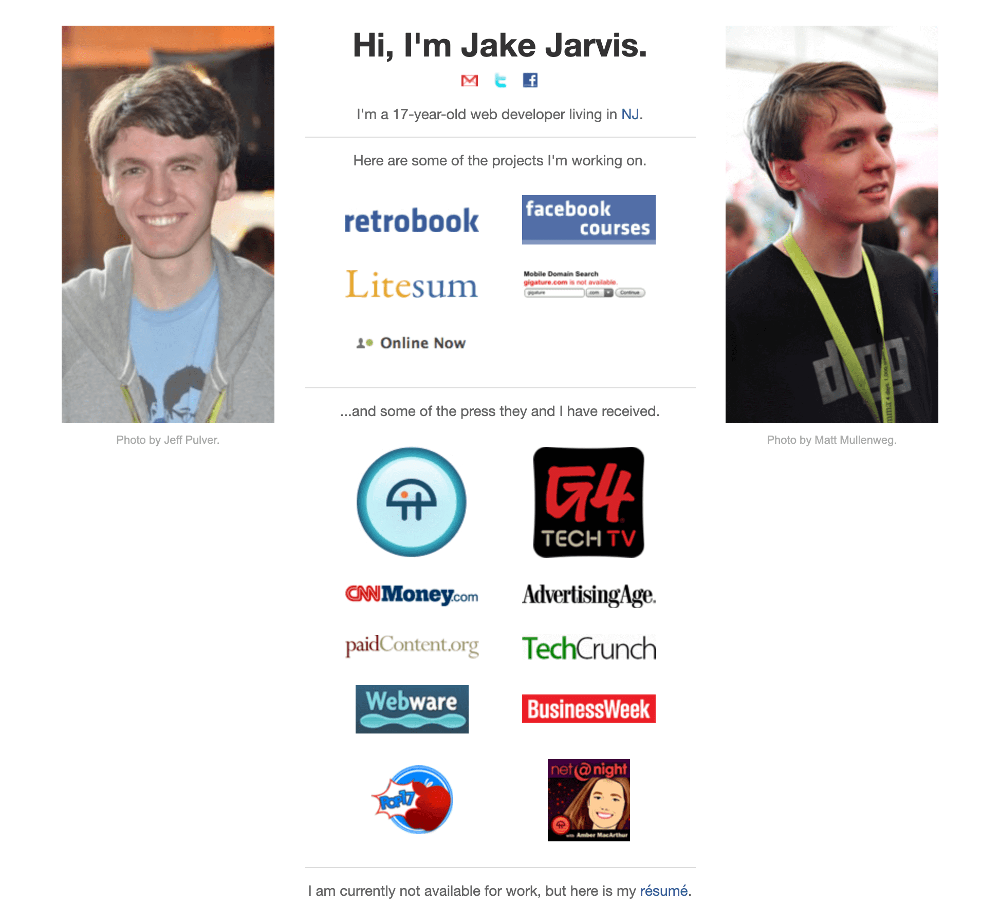
_July 2009_

---

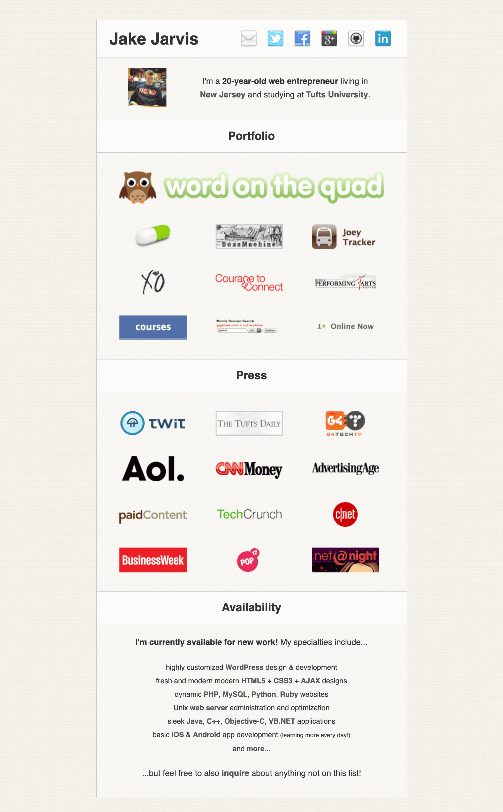
_[September 2012](https://focused-knuth-7bc10d.netlify.app/) ([view source](https://github.com/jakejarvis/jarv.is/tree/v1))_

---

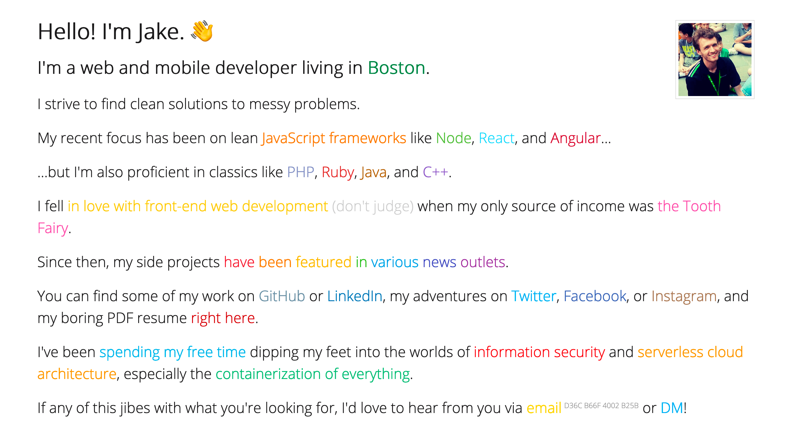
_[April 2018](https://hungry-mayer-40e790.netlify.app/) ([view source](https://github.com/jakejarvis/jarv.is/tree/v2))_

---

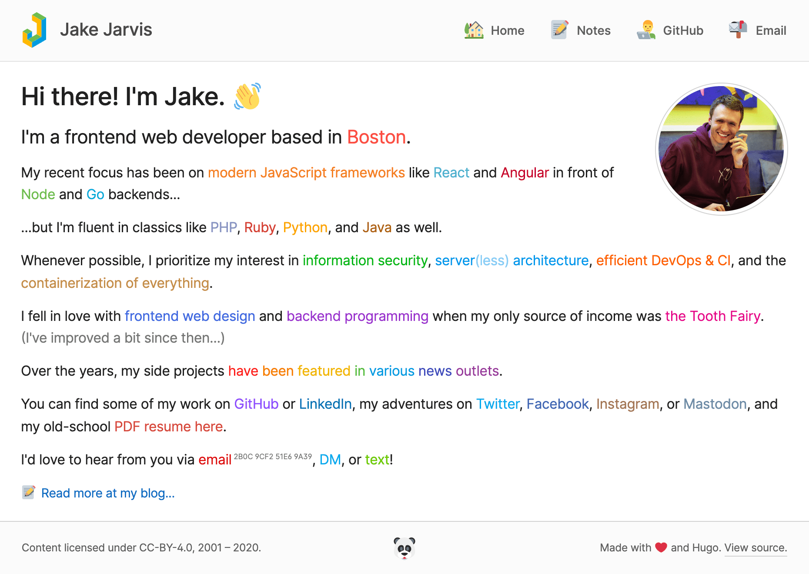
_[March 2020](https://quiet-truffle-92842d.netlify.app/) ([view source](https://github.com/jakejarvis/jarv.is-hugo))_
