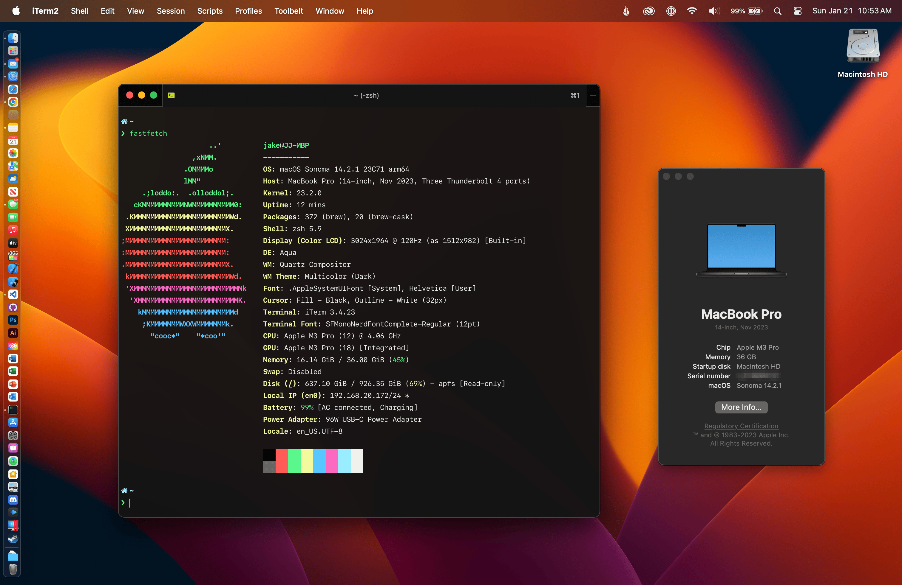

import PageTitle from "@/components/layout/page-title";
import Comments from "@/components/comments";
import { createMetadata } from "@/lib/metadata";

export const metadata = createMetadata({
  title: "/uses",
  description: "Things I use daily.",
  canonical: "/uses",
});

<PageTitle canonical="/uses">Uses</PageTitle>

~~I regularly get messages asking about which tools I use to work.~~

Nobody has asked me what I use. Ever. But here's a list of my daily drivers and necessities anyways, mostly revolving around my Apple sheepy-ness. Inspired by [many, many others](https://uses.tech/). ❤️

## 🚘&nbsp;&nbsp;Daily Drivers

- [**MacBook Pro** (14-inch)](https://browser.geekbench.com/v6/cpu/4493541)
  - Apple M3 Pro (12‑core CPU, 18‑core GPU) 🏎️💨
  - 36 GB RAM
  - 1 TB SSD
  - Space Black 🖤
- **iPhone 15 Pro**
  - 512 GB in Natural Titanium
  - [Anker MagGo Matte case](https://a.co/d/75zuyyY) (surprisingly nice!)
- **iPad Pro 10.5"**
  - 256 GB in Space Gray
  - Smart Keyboard & Apple Pencil
- **Apple Watch Series 9** (Cellular + GPS)
  - Aluminum – Midnight
  - 41mm (I have incredibly small wrists.)
  - Usually with the [Midnight Blue sport band](https://www.apple.com/shop/product/MLL02ZM/A/42mm-midnight-blue-sport-band-s-m-m-l), 🏳️‍🌈 [Pride Edition woven nylon band](https://www.apple.com/shop/product/MQ4F2AM/A/38mm-pride-edition-woven-nylon), or employee 🏋️ [Close Your Rings Challenge woven nylon band](https://www.macrumors.com/2018/04/03/apple-employees-rewards-challenge/).

## 🧪&nbsp;&nbsp;Homelab

- [**UniFi Dream Machine SE**](https://store.ui.com/us/en/products/udm-se), plus:
  - [Switch Enterprise 8 PoE](https://store.ui.com/us/en/products/usw-enterprise-8-poe)
  - 2x [U7 Pro access points](https://store.ui.com/us/en/products/u7-pro)
  - 2x [Switch Flex Mini 2.5G](https://store.ui.com/us/en/products/usw-flex-2-5g-5)
  - [UCI modem](https://store.ui.com/us/en/products/uci) _([It's Comcastic!™](https://www.youtube.com/watch?v=iW1tHr4Y_cI))_
- [**Synology DiskStation DS224+**](https://www.synology.com/en-us/products/DS224+)
  - 2x recertified [16TB WD Ultrastar](https://serverpartdeals.com/products/western-digital-ultrastar-dc-hc550-wuh721816ale6l4-0f38462-16tb-7-2k-rpm-sata-6gb-s-512e-512mb-3-5-se-manufacturer-recertified-hdd) drives
  - [**Plex**](https://www.plex.tv/personal-media-server/) (installed as a package via [`syno.plexupdate`](https://github.com/michealespinola/syno.plexupdate) for hardware encoding)
- 2x [**Dell Optiplex 7060 Micro**](https://www.servethehome.com/dell-optiplex-7060-micro-tinyminimicro-at-65w-tdp-cpu-overview/) mini PCs
  - Both are running [**Proxmox VE**](https://www.proxmox.com/en/products/proxmox-virtual-environment/overview) with various VMs and LXC containers spread between the two, including:
    - [Home Assistant](https://www.home-assistant.io/)
    - [Homebridge](https://homebridge.io/)
    - [Scrypted](https://www.scrypted.app/)
    - [Homepage](https://gethomepage.dev/)
    - [Gitea](https://about.gitea.com/)
    - [Immich](https://immich.app/)
    - [Sonarr](https://sonarr.tv/), [Radarr](https://radarr.video/), [Bazarr](https://www.bazarr.media/), [Prowlarr](https://github.com/Prowlarr/Prowlarr)
    - [qBittorrent](https://www.qbittorrent.org/) (web client)
    - [Tautulli](https://tautulli.com/)
    - [Traefik](https://traefik.io/traefik/)
    - [Authelia](https://www.authelia.com/)
  - Full post with more details coming soon!

## 💾&nbsp;&nbsp;Development

- [**iTerm 2**](https://iterm2.com/)
  - My various [ZSH aliases](https://github.com/jakejarvis/dotfiles/blob/main/zsh/aliases.zsh) and [functions](https://github.com/jakejarvis/dotfiles/blob/main/zsh/functions.zsh) are in [my `.dotfiles` repository.](https://github.com/jakejarvis/dotfiles)
  - [Oh My ZSH](https://ohmyz.sh/)
    - [zsh-autosuggestions](https://github.com/zsh-users/zsh-autosuggestions)
    - [zsh-syntax-highlighting](https://github.com/zsh-users/zsh-syntax-highlighting)
- [**Visual Studio Code**](https://code.visualstudio.com/)
  - [All of my settings.](https://github.com/jakejarvis/dotfiles/tree/main/vscode)
  - Themes:
    - [GitHub Dark theme](https://marketplace.visualstudio.com/items?itemName=GitHub.github-vscode-theme)
    - [Material Icon theme](https://marketplace.visualstudio.com/items?itemName=PKief.material-icon-theme)
    - [SF Mono font](https://developer.apple.com/fonts/)
  - Extensions:
    - [EditorConfig](https://marketplace.visualstudio.com/items?itemName=EditorConfig.EditorConfig)
    - [ESLint](https://marketplace.visualstudio.com/items?itemName=dbaeumer.vscode-eslint)
    - [GitHub Pull Requests](https://marketplace.visualstudio.com/items?itemName=GitHub.vscode-pull-request-github)
    - [Import Cost](https://marketplace.visualstudio.com/items?itemName=wix.vscode-import-cost)
    - [MDX](https://marketplace.visualstudio.com/items?itemName=unifiedjs.vscode-mdx)
    - [Prettier](https://marketplace.visualstudio.com/items?itemName=esbenp.prettier-vscode)
    - [Stylelint](https://marketplace.visualstudio.com/items?itemName=stylelint.vscode-stylelint)
- [**Homebrew**](https://brew.sh/)
  - [View my messy `Brewfile` dump](https://github.com/jakejarvis/dotfiles/blob/main/Brewfile) with all of my installed packages.
- [**Xcode**](https://developer.apple.com/xcode/)
- [**Docker Desktop**](https://www.docker.com/products/docker-desktop)
- [**Parallels Desktop Pro**](https://www.parallels.com/products/desktop/)
  - Switched from VMware Fusion when Parallels beat them to the punch with [M1 support](https://www.parallels.com/blogs/parallels-desktop-m1/).
- [**Sketch**](https://www.sketch.com/)
- [**Adobe Creative Cloud**](https://www.adobe.com/creativecloud.html)
  - Still on the $20/month [Student Plan](https://www.adobe.com/creativecloud/buy/students.html), somehow. 🤫 Will need to re-evaulate once I'm kicked off; it's hard to justify spending almost 3x that...
- [**Transmit**](https://panic.com/transmit/)
- [~~Sequel Pro~~](https://www.sequelpro.com/) → [**TablePlus**](https://tableplus.com/)
- [~~Robo 3T~~](https://robomongo.org/) → [**TablePlus**](https://tableplus.com/)
- [**ImageOptim**](https://imageoptim.com/mac)
- [**Sip**](https://sipapp.io/)
- [**Local**](https://localwp.com/) for WordPress development.

## 🌎&nbsp;&nbsp;Browsing

- [**Firefox**](https://www.mozilla.org/en-US/firefox/new/) 🦊
  - [My default `user.js` settings.](https://github.com/jakejarvis/dotfiles/blob/main/firefox/user.js)
  - Extensions:
    - [1Password](https://1password.com/downloads/browser-extension)
    - [Dark Reader](https://addons.mozilla.org/en-US/firefox/addon/darkreader/)
    - [React Developer Tools](https://addons.mozilla.org/en-US/firefox/addon/react-devtools/)
    - [OctoLinker](https://addons.mozilla.org/en-US/firefox/addon/octolinker/)
    - [Privacy Badger](https://addons.mozilla.org/en-US/firefox/addon/privacy-badger17/)
    - [Raindrop.io](https://raindrop.io/)
    - [uBlock Origin](https://addons.mozilla.org/en-US/firefox/addon/ublock-origin/)

## 💻&nbsp;&nbsp;macOS

- [**1Password**](https://1password.com/)
- [**Little Snitch**](https://www.obdev.at/products/littlesnitch/index.html)
- [**iStat Menus**](https://bjango.com/mac/istatmenus/)
- [**Backblaze**](https://www.backblaze.com/) ([referral link](https://secure.backblaze.com/r/00x84e))
- [**Raindrop.io**](https://raindrop.io/)
- [**MacUpdater**](https://www.corecode.io/macupdater/)
- [**AppCleaner**](https://freemacsoft.net/appcleaner/)
- [**GPG Suite**](https://gpgtools.org/)
- ~~VLC~~ → [**IINA**](https://iina.io/)
- [**Transmission**](https://transmissionbt.com/)
- [**Amphetamine**](https://roaringapps.com/app/amphetamine)
- [**TG Pro**](https://www.tunabellysoftware.com/tgpro/)
- [**Keka**](https://www.keka.io/en/)

## 📱&nbsp;&nbsp;iOS

I have far too many apps to count, but here the essentials that have earned a spot on my home screen:

- [**1Password** (beta)](https://apps.apple.com/app/id568903335)
- [**Waze** (beta)](https://apps.apple.com/app/id323229106)
- [**Pocket Casts**](https://apps.apple.com/app/id414834813)
- [**Raindrop.io**](https://apps.apple.com/app/id1021913807)
- [**Plex** (beta)](https://apps.apple.com/app/id383457673)
- [**Discord**](https://apps.apple.com/app/id985746746)
- [**UniFi**](https://apps.apple.com/app/id1057750338) and [**WiFiman**](https://apps.apple.com/app/id1385561119)

## ☁️&nbsp;&nbsp;Cloud

I've been making recent efforts to [de-Google](/zip) my life, with mixed results...

- ~~Gmail~~ → [**Fastmail**](https://www.fastmail.com/) ([referral link](https://ref.fm/u20274504)) & [**Mail.app**](https://en.wikipedia.org/wiki/Apple_Mail)
- ~~Google Drive~~ → ~~Dropbox~~ → [**iCloud Drive**](https://www.icloud.com/iclouddrive)
  - [Read why.](/notes/dropping-dropbox)
- ~~Google Docs~~ → [**Microsoft Office**](https://products.office.com/en-us/mac/microsoft-office-for-mac) (hey, it works 🤷)
- ~~Google Photos~~ → [**iCloud Photos**](https://www.icloud.com/photos/) and [**Immich**](https://immich.app/)
- ~~Google Analytics~~ → [**Fathom Analytics**](https://usefathom.com/) ([referral link](https://usefathom.com/ref/ZEYG0O))
- ~~Google Public DNS~~ → [**Cloudflare's 1.1.1.1**](https://1.1.1.1/dns/) on my home network.
- ~~GoDaddy~~ → ~~Google Domains~~ → [**Cloudflare Registrar**](https://www.cloudflare.com/products/registrar/) (and [**ISNIC**](https://isnic.is/en/) for this domain, of course 🇮🇸)

Other geeky stuff:

- [**Vercel**](https://vercel.com/) and [**Netlify**](https://www.netlify.com/) for "serverless" sites.
- [**DigitalOcean**](https://www.digitalocean.com/) ([referral link](https://m.do.co/c/afcf288a7dac)) and [**Linode**](https://www.linode.com/) ([referral link](https://www.linode.com/?r=0c5aeace9bd591be9fbf32f96f58470295f1ee05)) for virtual Linux servers.
- [**DNSimple**](https://dnsimple.com/) ([referral link](https://dnsimple.com/r/eb6ced548f1e0a)) and [**Cloudflare**](https://www.cloudflare.com/) for domain DNS.
- [**Backblaze**](https://www.backblaze.com/) ([referral link](https://secure.backblaze.com/r/00x84e)) for off-site Mac backups.
- [**Gitea**](https://gitea.io/en-us/) as a [self-hosted](https://git.jrvs.io/) Git backup/mirror.
- [**Tailscale**](https://tailscale.com/) to access my home network and VPSes from anywhere.

## 🏠&nbsp;&nbsp;Internet of ~~Things~~ Crap

- [**Philips Hue**](https://www2.meethue.com/en-us) color bulbs, dimmer switches, etc.
- 2x [**ecobee3 lite**](https://www.ecobee.com/en-us/smart-thermostats/smart-wifi-thermostat/)
- 2x [**Sonos One**](https://www.sonos.com/en-us/shop/one.html) (with Alexa turned off...hopefully? 🤫)
- 2x [**Apple TV 4K** (2021)](https://www.apple.com/apple-tv-4k/)

---

<Comments title="/uses" />
