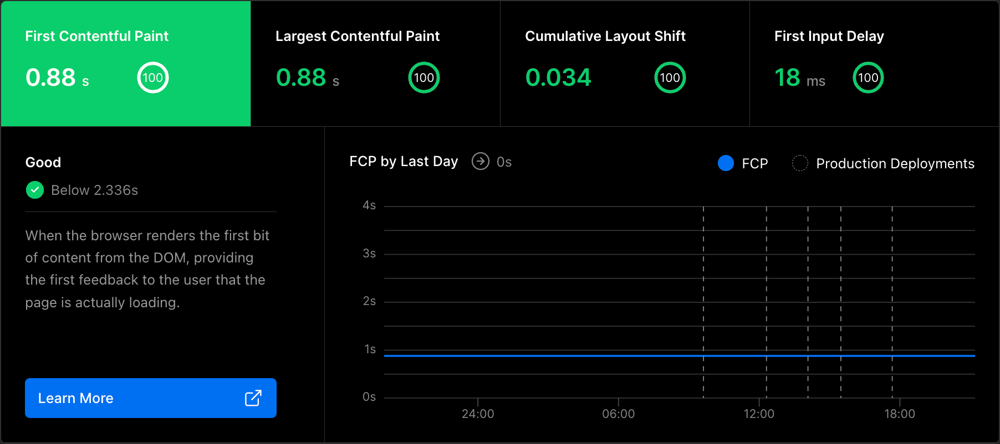

import featuredImage from "./web-vitals.png";

export const frontmatter = {
  title: "Revenge of the JavaScript: Moving from Hugo to Next.js",
  date: "2022-04-07 10:53:33-0400",
  description:
    "The next chapter in this website's history of overengineering, from static HTML with Hugo to React everywhere with Next.js.",
  tags: ["React", "JavaScript", "Next.js", "Hugo", "Meta"],
  image: featuredImage.src,
};

I'll say right off the bat: this website has a _loooong_ history of going overboard with its tech stack. I use this domain as a vehicle to [learn new things](https://www.jvt.me/talks/overengineering-your-personal-website/), and given [how frequently](https://stackoverflow.blog/2018/01/11/brutal-lifecycle-javascript-frameworks/) the tides turn in the frontend development waters these days, things can (and did) get messy pretty quickly.

I discovered [**Hugo**](https://gohugo.io/) and started using it almost four years ago ([`6fff44e`](https://github.com/jakejarvis/jarv.is/commit/6fff44e8e2773d0ca417879b4dd69860871cd89c)) in an effort to get back to the basics. Static site generators and buzzwordy [JAMstack](https://www.cloudflare.com/learning/performance/what-is-jamstack/) philosophies were all the rage, and the potential simplicity of having a website with HTML that I could have understood [as a kid](/previously) sounded fun and refreshing. Very quickly, I became a huge Hugo [cheerleader](https://github.com/jakejarvis?tab=repositories&q=hugo), and I didn't even add _any_ JavaScript for over a year as a kind of challenge to myself. But as I saw certain JS frameworks and tools explode in popularity, some FOMO started setting in, and bringing things like [React](https://reactjs.org/) into the mix became incredibly tempting.

Turning to lighter frameworks like [Lit](https://lit.dev/) and then [Preact](https://preactjs.com/) allowed me to tell myself I was still being a minimalist while dipping my toes in the component-filled waters. I added Preact ([`b755b66`](https://github.com/jakejarvis/jarv.is/commit/b755b66d1982892b3de914f9cc5bded2d7b99bc7)) to power the [/projects](/projects) page, the [contact form](/contact), and the hit counter at the top of posts like this one. These components were made dynamic via [serverless functions](https://github.com/jakejarvis/jarv.is/tree/v4/api) written in — you guessed it — JavaScript.

By the end of the Hugo chapter, I was using a [cornucopia](https://github.com/jakejarvis/jarv.is/blob/v4/package.json) of build tools behind the scenes to keep everything glued together: [Webpack](https://webpack.js.org/), [Gulp](https://gulpjs.com/), [esbuild](https://esbuild.github.io/), [Babel](https://babeljs.io/), [Terser](https://terser.org/), [PostCSS](https://postcss.org/), [node-sass](https://github.com/sass/node-sass), [imagemin](https://github.com/imagemin/imagemin)... That's a **_lot_** of JavaScript tooling for a site that's allegedly avoiding JavaScript at all costs, and realizing this let me _finally_ give myself permission to go all-in.

Enter [**Next.js**](https://nextjs.org/), which caught my eye over other JS-centric SSGs (like [Gatsby](https://www.gatsbyjs.com/), [11ty](https://www.11ty.dev/), or [Hexo](https://hexo.io/)) because it sounded like the best of both worlds. Next outputs a fully static HTML version of your site just like Hugo does **and** uses React to render pages dynamically (a bit like a single-page web app would behave). And once I learned how its [incremental static regeneration](https://nextjs.org/docs/basic-features/data-fetching/incremental-static-regeneration) feature works, I realized that my Hugo site was actually **less static** than it could be with a framework like Next! Pages like [/projects](/projects), which pulls data from the GitHub API, had no actual content if you were to right-click and view source — but with Next, the project data actually exists in the static HTML initially sent by the server and is ["hydrated"](https://reactjs.org/docs/react-dom.html#hydrate) with the same data via React on the client-side. If you host everything on [Vercel](https://vercel.com/), this becomes even more seamless. (More on that later.)

## My requirements for Next.js

- **Page sizes remain well under 1 MB.** Minus images and third-party things like Twitter embeds, of course, I think I've achieved this on every page — the [homepage](/) still hovers around only 512 kB in total! Being _super_ careful when choosing dependencies ([Bundlephobia](https://bundlephobia.com/) is awesome, btw) and making sure [not to send](https://next-code-elimination.vercel.app/) any server-side code to the browser can make a huge difference.
- **All content and core functionality is still available without JavaScript.** Go ahead and try it! Besides the obvious reasons, this was also crucial in keeping the [🧅 Tor mirror](http://jarvis2i2vp4j4tbxjogsnqdemnte5xhzyi7hziiyzxwge3hzmh57zad.onion/) functional.
- **Fewer `devDependencies` and consolidated build tooling.** I don't want to look at another Gulp task for as long as possible. Next's [built-in](https://nextjs.org/docs/api-reference/next.config.js/custom-webpack-config) Webpack and Babel support has come in clutch here.
- **Same (or better) [Lighthouse scores](https://web.dev/learn/#lighthouse).** The heavier load of JS has certainly affected performance a bit, but any modern browser can easily keep up with any React code I'll be using at this scale. And because of Next's static page generation (and [next-seo](https://github.com/garmeeh/next-seo)) nothing has changed in the realm of SEO.

## Things I still miss from Hugo

- **Native [Markdown](https://daringfireball.net/projects/markdown/) support with [shortcodes](https://gohugo.io/content-management/shortcodes/).** I'm enjoying the React-ified [MDX](https://mdxjs.com/) flavor of Markdown, but wrestling with [@next/mdx](https://www.npmjs.com/package/@next/mdx), [next-mdx-remote](https://github.com/hashicorp/next-mdx-remote), and/or [mdx-bundler](https://github.com/kentcdodds/mdx-bundler) adds a whole new layer of ~~potential~~ breakage. Nothing beats the native parser that comes with Hugo when it comes to convenience and compatibility.
- **Pure HTML output.** This is a bit of a fallacy, though, considering the number of serverless Lambda functions I ended up having.
- **Knowing every corner of the frontend code and how it works.** Don't ask me to explain what the `152-c95759cd62a.js` file you just downloaded does. Because I have no clue.
- **Total and complete portability.** In exchange for a _lot_ of convenience, I accepted a bit of vendor lock-in when I put all of my eggs in [Vercel's](https://vercel.com/solutions/nextjs) basket. Next.js is their creation, and other hosts (including [Netlify](https://docs.netlify.com/configure-builds/common-configurations/next-js/), [Render](https://render.com/docs/deploy-nextjs-app), [DigitalOcean](https://docs.digitalocean.com/tutorials/app-nextjs-deploy/), etc.) have begun adding support for some of the core functionality. But quite a few of the more exciting features (like [image optimization](https://vercel.com/docs/concepts/image-optimization) and [analytics](https://nextjs.org/analytics)) are clearly [designed for Vercel](https://nextjs.org/docs/deployment#managed-nextjs-with-vercel) and Vercel only.

Doing the actual migration was pretty boring and uneventful (besides the wealth of React knowledge I got to teach myself, which I'm sure is still less than 2% of what's out there). I found the goal with the least mental friction was to build a 1:1 replica of the Hugo site with Next.js, to the point where a visitor wouldn't have been able to tell there was a change, except for _much_ faster page transition times. You can track how that went in [this pull request](https://github.com/jakejarvis/jarv.is/pull/711) and judge for yourself...

As always, this entire site is [open source](https://github.com/jakejarvis/jarv.is), and I've also archived the Hugo version in [a separate repository](https://github.com/jakejarvis/jarv.is-hugo) for reference and comparison.

Let me know what you think about the "new" site as well as frameworks like React and hybrid static/server tools like Next.js. To anyone else currently using Hugo or building pure HTML sites, have you been tempted recently by a JavaScript framework du-jour? Or are you ignoring the hype and waiting for the next trendy project to come along and "change everything" yet again? ([Remix](https://remix.run/) is my prediction, for what it's worth...)
