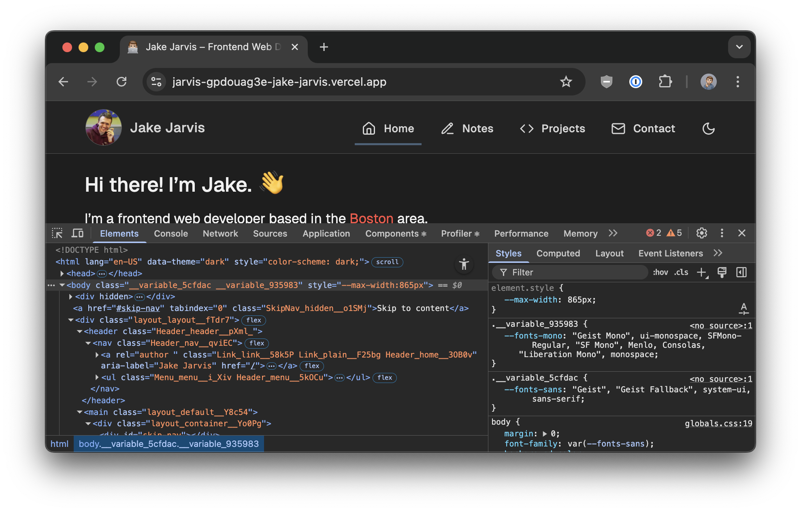
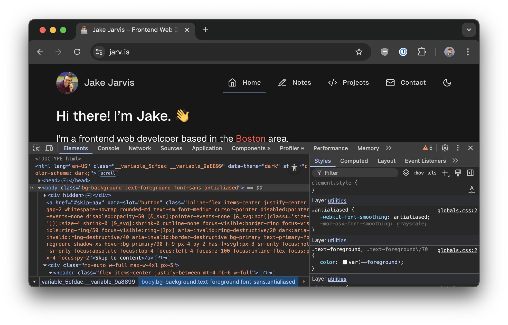

I have a confession. I've **hated** [Tailwind CSS](https://tailwindcss.com/). For years.

Every time a Tailwind ["hit piece"](https://dev.to/kerryboyko/tailwindcss-adds-complexity-does-nothing-3hpn) went viral, I quietly enjoyed the warm, fuzzy feeling of confirmation bias.

I've also never been the biggest advocate of anything AI (beyond providing a smarter autocomplete), but that's a post for another day. I do, however, appreciate what companies like [Vercel](https://vercel.com/home) are doing with tools like [**v0**](https://v0.dev/), or [Stackblitz](https://stackblitz.com/) with [**Bolt.new**](https://bolt.new/) (or especially new startups like [**Lovable**](https://lovable.dev/)). They're embarrassingly bad at generating anything close to full-stack right now, but are incredible at prototyping small drop-in React components like a [copy button](https://v0.dev/chat/custom-copy-button-6giyaNd8fmn) or even [beautiful charts](https://v0.dev/chat/next-js-charts-eygG8PAxk8z).

So what's the conundrum? These tools _love_ Tailwind (and its offspring — [shadcn/ui](https://ui.shadcn.com/) being the poster child). And I wanted to figure out why.

<Tweet id="1842643838281961934" />

As I usually do with any piece of software I want to learn more about, I used [this website](https://github.com/jakejarvis/jarv.is) as a testing ground. I started with a few one-liner components, like my styled [`<Blockquote>`](https://github.com/jakejarvis/jarv.is/tree/v6/components/Blockquote) for Markdown content. I quickly stumbled upon dozens of CSS to Tailwind "conversion" tools, but just as quickly realized that actually digging into Tailwind would be much easier. This lead to my first discovery:

🏆 **[Tailwind's documentation](https://tailwindcss.com/docs/styling-with-utility-classes) is some of the best I've ever seen.**

Seriously, it's so good that even if you're not using Tailwind, their docs clearly explain and visually demonstrate all of the most [nonsensical](https://tailwindcss.com/docs/flex-basis) CSS "features" I've always struggled to master.

After converting a few more components, I started to feel better and better each time I deleted a [`.module.css`](https://github.com/jakejarvis/jarv.is/blob/v6/components/Blockquote/Blockquote.module.css) file. What I thought would make my code infinitely more complicated and messy was actually making it simpler and cleaner. Each component no longer needed its own folder. Colors and spacing were becoming more consistent. Pixels I struggled to line up previously were now coincidentally falling in line. Best of all, **I didn't have to name anything anymore!** 🎉

<ImageDiff>
  
</ImageDiff>

Don't get me wrong, I still think the syntax Tailwind forces you to write is an abomination. **But honestly, so was my CSS.**

Maybe that's on me, or maybe not, but my primary reason to hate on Tailwind for years — _"it makes my HTML/JSX ugly and design doesn't belong sprinkled throughout a markup language"_ — just flew out the window either way. Sure, I tried to make my CSS consistent and logical, making tons of variables for colors and sizes and border radii. But that wasn't nearly as comforting as being certain that `w–12` will **always** be twice the width of `w–6` no matter how badly I mess things up.

And on top of all of the AI tools mentioned above being Tailwind experts, the [IDE support](https://tailwindcss.com/docs/editor-setup) is also excellent. One click to install the official [IntelliSense extension](https://marketplace.visualstudio.com/items?itemName=bradlc.vscode-tailwindcss) for VS Code, and suddenly everywhere I wrote `text–sky–400` throughout my code had a lovely little light blue square next to it. The official [Prettier extension](https://github.com/tailwindlabs/prettier-plugin-tailwindcss) ensures the order of class names doesn't cause unexpected specificity problems from a rule four layers up overriding a rule you thought you were currently looking at — historically my biggest painpoint of CSS by far.

All of these tools together actually made the [process](https://github.com/jakejarvis/jarv.is/pull/2387) of revamping this site oddly fun. It shined a spotlight on a lot of issues I had no idea were there — especially by forcing me to think ["mobile-first"](https://tailwindcss.com/docs/responsive-design#working-mobile-first) — and gave me an opportunity to put a new coat of paint on a design I haven't made major changes to [since my last blog post](/notes/hugo-to-nextjs)...three years ago.

So, if you're a closeted Tailwind hater like I was, try it out. I don't think I'll ever love Tailwind, to be honest. But I certainly like it a lot more than I ever liked CSS.
